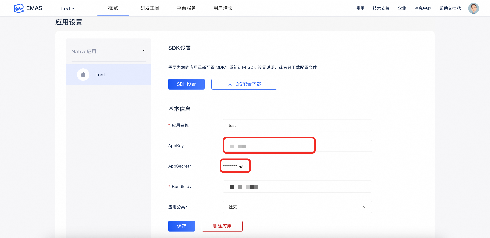

# 移动用户反馈 Demo iOS 版

## 一、产品介绍
用户反馈(Feedback)是一款帮助移动开发者在APP内收集消费者问题反馈和意见建议，并且在后台集中分析和回复的产品（此外，自动抓取开发者APP在应用市场的评论数据，帮助开发者及时掌握用户对应用的评论）。

## 二、App客户端功能说明
 1. 发送文字
 2. 发送图片
 3. App客户端UI自定义
 4. 显示未读消息数
 5. 发送语音

## 三、管理控制台
 1. 回复消息
 2. 打标签
 3. 收藏反馈
 4. 搜索文字反馈
 5. 导出少量反馈
 6. 导出大量反馈
 7. 搜索反馈人
 8. 建立二级标签
 9. 自动打标签
 10. 批量打标签
 11. 批量回复
 12. H5增加语音开关

## 四、接入流程
 1. 注册阿里云账号。注册地址：https://account.aliyun.com/register/register.htm
 2. 阿里云官网https://cn.aliyun.com/ 选择-产品->企业服务与云通信->移动研发平台 EMAS->移动用户反馈。

 3. 没有应用，需要创建应用。
    
    产品控制台->添加项目->立即添加应用

 4. 客户端集成。

	 目前支持iOS、Android端

     下载客户端SDK并集成，地址：https://mhub.console.aliyun.com/downloadSdk

## Demo说明

该Demo提供了App不同应用场景集成移动用户反馈服务的示例。

Demo仅作为原理讲解和示例代码用途，
强烈建议在搞清楚各场景下移动用户反馈接入实现细节和原理后，再集成到App线上环境。

## 使用方法

### 1. 创建APP

您首先需要登入控制台，创建一个 APP 实体以对应您准备使用的 Demo APP。关于 APP 创建的指引文档可以参考：

- [ 《移动用户反馈 - 开发指南 - 终端SDK手册 - iOS SDK手册》]( https://help.aliyun.com/document_detail/53145.html?spm=5176.doc53324.6.555.KEwgHA )

创建完 APP 后，您还需要配置您的 APP ，注意 appkey 的设置，要与控制台保持一致，并根据业务需要选择是否开启鉴权功能。

### 2. 下载Demo工程

将工程克隆或下载到本地：

> git clone https://github.com/aliyun/alicloud-ios-demo.git

本 Demo 的文件夹名字叫做：feedback_ios_demo。

**当您在使用您自己的 APP 集成 SDK 遇到问题时，您可以对比下 demo APP 的配置情况。**

### 3. 配置APP信息

为了使Demo APP能够正常运行，您还需要将’YWLoginController.m‘类中的’kAppKey‘和’kAppSecret‘修改为您自己的AppKey/AppSecret。您可以在EMAS控制台，第一步创建的APP中找到它们，如图所示：

### 4. 运行 Demo

执行`pod instal` or `pod update`，拉取依赖SDK包。

用 Xcode 打开 `***.xcworkspace` 文件，即可运行该Demo。

## 联系我们

 - 官网：移动用户反馈[《移动用户反馈》]( https://help.aliyun.com/document_detail/53145.html?spm=5176.doc53324.6.555.KEwgHA )
 - 钉钉技术支持：11711519（钉钉群号）
 - 官方技术博客：[《阿里云移动服务》]( https://yq.aliyun.com/teams/32 )
