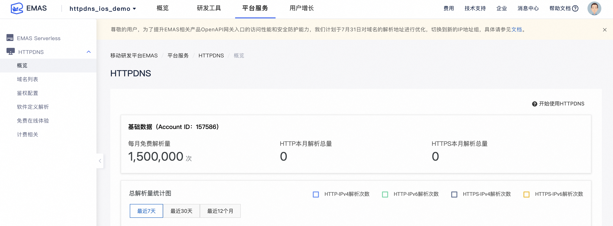
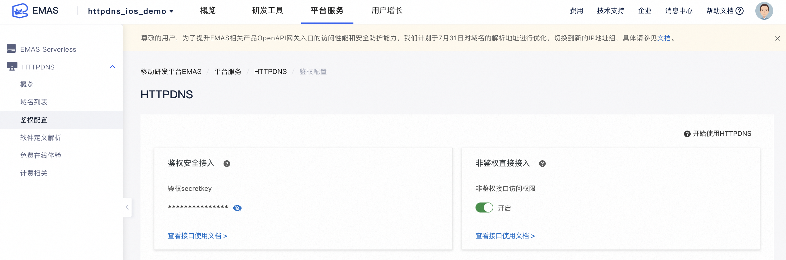
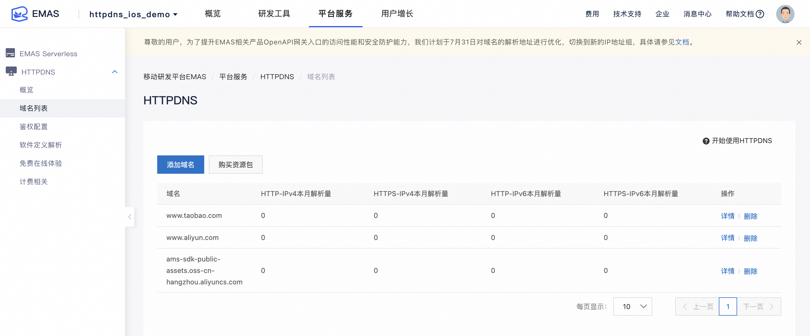
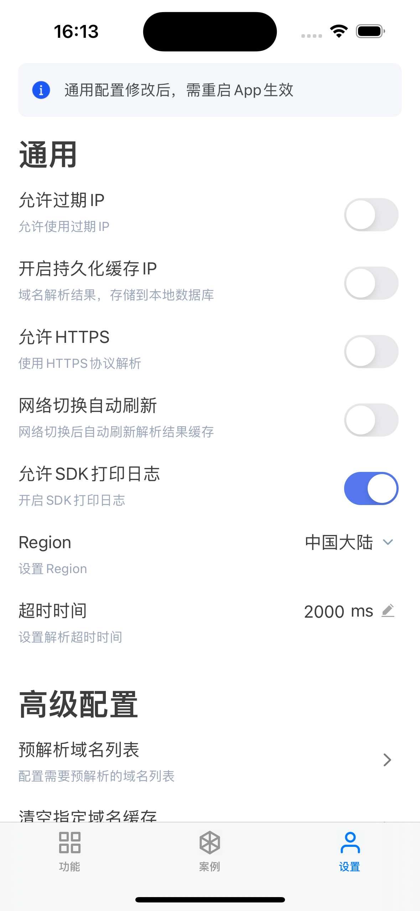

# HTTPDNS Demo iOS 版


<p align="center">

<a href=""></a>
<a href=""></a>
<a href=""></a>
<a href=""></a>
<a href=""></a>

</p>


<div align="center">


</div>


## 产品概述


HTTPDNS 是面向移动开发者推出的一款域名解析产品，具有域名防劫持、精准调度等特性。

开通 HTTPDNS 服务后，您就可以在管理控制台添加要解析的域名，调用服务 API 进行域名解析。

> HTTPDNS 是一款`递归DNS`服务，与`权威DNS`不同，HTTPDNS 并不具备决定解析结果的能力，而是主要负责解析过程的实现。关于 HTTPDNS 更详细的介绍可以参考官方博文[移动互联网时代，如何优化你的网络 —— 域名解析篇](https://yq.aliyun.com/articles/58967?spm=5176.100244.teamhomeleft.195.8WqcCX)

### **产品特性**

#### **安全、精准的解析结果**

- 使用 HTTP 协议访问阿里云的服务端，获得域名解析结果，绕过运营商的 Local DNS ，避免域名劫持。


-  HTTPDNS 能够直接得到客户端的出口网关 IP，从而更准确地判断客户端地区和运营商，得到更精准的解析结果。

#### **全网域名支持**

- HTTPDNS 支持全网域名的解析，包括在阿里云（万网）注册的域名，和其它第三方的域名。

#### **简洁的API接口，满足不同的使用场景**

- HTTPDNS 对外提供简洁的 API 接口，典型场景是移动端 APP 直接调用该接口解析域名，也支持在服务端调用的场景。


-  对于移动端的场景，提供完整的 Android 和 iOS 使用示例。


## Demo说明

该Demo提供了App不同应用场景集成HTTPDNS服务的示例。

Demo仅作为原理讲解和示例代码用途，
强烈建议在搞清楚各场景下HTTPDNS接入实现细节和原理后，再集成到App线上环境。


## 使用方法

### 1. 创建APP


您首先需要登入控制台，创建一个 APP 实体以对应您准备使用的 Demo APP。关于 APP 创建的指引文档可以参考：
 [《HTTPDNS - 开发指南 - 终端SDK手册 - iOS SDK手册》]( https://help.aliyun.com/document_detail/150881.html?spm=a2c4g.11186623.6.586.439a67dbNXSkxw ) 

创建完 APP 后，您还需要配置您的 APP ，注意 AccountID 的设置，要与控制台保持一致，并根据业务需要选择是否开启鉴权功能。


### 2. 下载Demo工程

将工程克隆或下载到本地：

> git clone https://github.com/aliyun/alicloud-ios-demo.git

本 Demo 的文件夹名字叫做：httpdns_ios_demo。


**项目结构**


Demo的结构如下：做下说明：

 ```Objective-C

├── AlicloudHttpDNS.xcframework # SDK 库
├── AlicloudUtils.xcframework   # SDK 依赖库
├── AlicloudUTDID.xcframework   # SDK 依赖库
├── AFNetworking.framework      # 三方网络库
├── Alamofire.xcframework       # 三方网络库
└──  httpdns_ios_demo         # Demo 演示部分
       
 ```
 
**当您在使用您自己的 APP 集成 SDK 遇到问题时，您可以对比下 demo APP 的配置情况。**


### 3. 配置APP信息

3.1 配置 accountID、secretKey

为了使Demo APP能够正常运行，您还需要配置您的accountID/secretKey信息，您可以分别从EMAS控制台“概览”和“鉴权配置”中找到它们，如图所示：





3.2 配置需要解析的域名列表

Demo中内置了通用的 `httpdns-domains.plist` 配置文件，只能解析部分已配置的域名，如需解析其他域名，需进入EMAS后台`域名列表`添加要解析的域名，如图所示：



### 4. 运行 Demo

Demo采用cocoapods管理依赖库，运行前需先执行 `pod install` 命令安装依赖库
然后 Xcode 打开 `httpdns_ios_demo.xcworkspace` 文件，即可运行该Demo，同时建议打开调试开关：

<div align="center">



</div>

## 演示的场景

## 1. HTTPS场景

### 1.1 普通HTTPS场景
- 基于网络API NSURLSession发送HTTPS请求；
- 相关示例代码:
    - HTTPSSimpleScenario
    
### 1.2 HTTPS(含SNI)场景
- 基于网络API NSURLSession发送HTTPS(含SNI)请求，通过替换NSURLProtocol的实现进行证书处理：
- 相关示例代码:
    - HTTPSWithSNIScenario
    - HttpDnsNSURLProtocolImpl
    
## 2. 普通场景
- 基于网络API NSURLSession发送HTTP请求；
- 相关示例代码:
    - GeneralScenario

## 3. AFNetworking场景

### 3.1 AFNetworking发送普通HTTPS场景
- 基于AFNetworking网络库发送HTTPS网络请求；
- 相关示例代码:
    - AFNHttpsScenario

### 3.2 AFNetworking发送HTTPS(含SNI)场景
- 基于AFNetworking网络库发送HTTPS(含SNI)请求，通过替换NSURLProtocol的实现进行证书处理：
- 相关示例代码:
    - AFNHttpsWithSNIScenario
    - HttpDnsNSURLProtocolImpl

## 4. Alamofire场景

### 4.1 Alamofire发送普通HTTPS请求
- 基于Alamofire网络库发送HTTPS网络请求；
- 相关示例代码:
    - AlamofireHttpsScenario

### 4.2 Alamofire发送HTTPS(含SNI)场景
- 基于Alamofire网络库发送HTTPS(含SNI)请求，通过替换NSURLProtocol的实现进行证书处理：
- 相关示例代码：
    - AlamofireHttpsWithSNIScenario
    - HttpDnsNSURLProtocolImpl
    
## 5. AVPlayer场景
- AVPlayer播放HTTPS视频，通过创建 AVURLAsset 并使用自定义的 AVAssetResourceLoaderDelegate进行证书处理：
- 相关示例代码：
    - CustomResourceLoaderDelegate
    - AVPlayerScenario


## 联系我们

 - 官网：[《HTTPDNS》]( https://cn.aliyun.com/product/httpdns?spm=5176.7841952.765261.327.AS1VQb ) 
 - 钉钉技术支持：11777313（钉钉群号）
 - 官方技术博客：[《阿里云移动服务》]( https://yq.aliyun.com/teams/32 ) 


