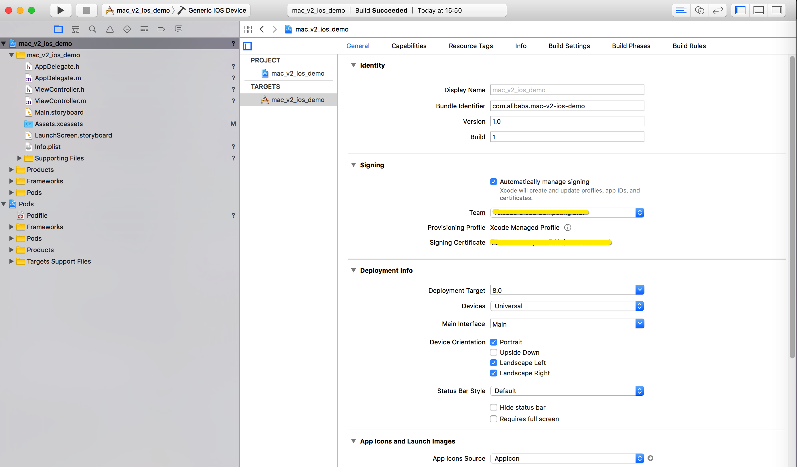
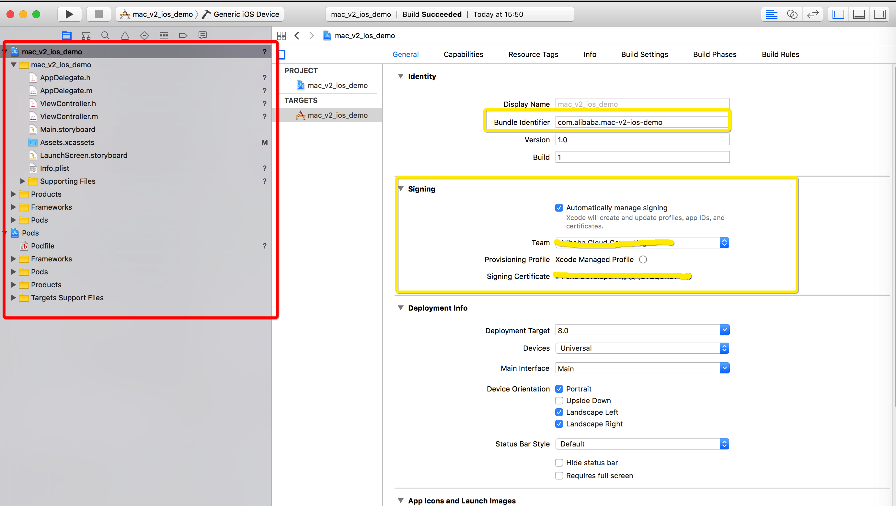

# 阿里云移动加速 iOS Demo App


[](https://github.com/aliyun/aliyun-specs)
[](https://mhub.console.aliyun.com/#/download)

## 使用方法

### 下载Demo工程

- 将本工程Clone到本地：

```
git clone git@github.com:aliyun/alicloud-ios-demo.git
```

- Xcode加载后找到mac_v2_ios_demo，如下图所示：

<div align="center">

</div>

### 配置工程

- 修改App BundleId和签名，如下图所示：

<div align="center">

</div>

### 工程修改

- 在下述初始化代码中用您的appkey/appsecret替换`******`字段占据的参数。

```objc
static NSString *testAppKey = @"******";
static NSString *testAppSecret = @"******";

/* 移动加速SDK初始化 */
- (void)macSDKInit {
    /* 打开Log */
    [[AlicloudMACService sharedInstance] setLogEnabled:YES];
    [[AlicloudMACService sharedInstance] initWithAppKey:testAppKey appSecret:testAppSecret callback:^(BOOL res, NSError *error) {
        if (res) {
            [self showLog:@"MAC SDK init success."];
        } else {
            [self showLog:[NSString stringWithFormat:@"MAC SDK init failed, error: %@", error]];
        }
    }];
}
```

- 网络请求URL替换为自己App业务URL。

```objc
[self sendNetworkRequest:@"https://********" completionHandler:^(BOOL res, NSHTTPURLResponse *response, NSError *error) {}];
```
