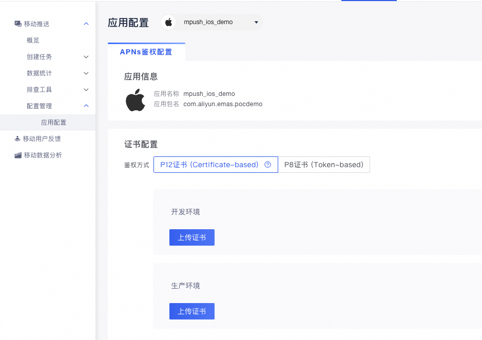
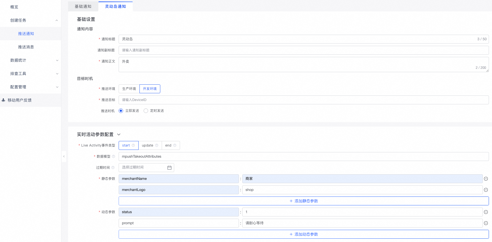
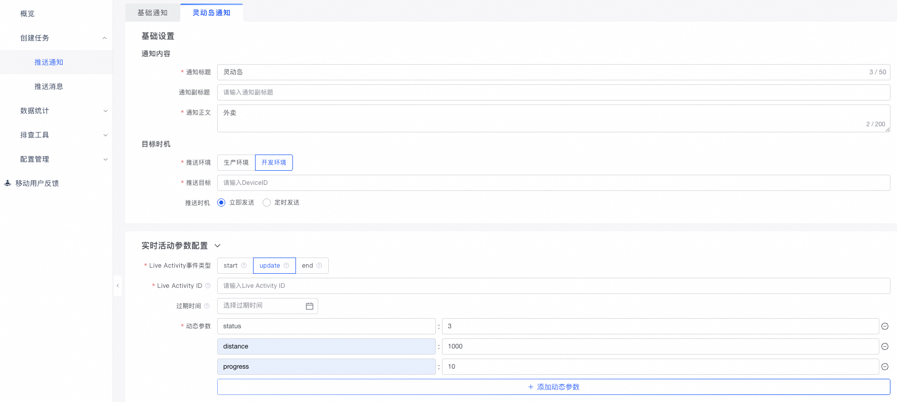

# 阿里云移动推送Demo APP iOS版

<p align="center">

<a href=""></a>
<a href=""></a>
<a href=""></a>
<a href=""></a>

</p>

<div align="center">

</div>

> 阿里云移动推送（Alibaba Cloud Mobile Push）是基于大数据的移动智能推送服务，帮助App快速集成移动推送的功能，在实现高效、精确、实时的移动推送的同时，极大地降低了开发成本。让开发者最有效地与用户保持连接，从而提高用户活跃度、提高应用的留存率。

## 产品特性
- 高效稳定——与手机淘宝使用相同架构，基于阿里集团高可用通道。该通道日均消息发送量可达30亿，目前活跃使用的用户达1.8亿。
- 高到达率——Android 智能通道保活，多通道支持保证推送高到达率。
- 精确推送——基于阿里大数据处理技术，实现精确推送。
- 应用内消息推送——支持 Android 与 iOS 应用内私有通道，保证透传消息高速抵达。

## 使用方法

### 1. 创建APP

您首先需要登入移动推送控制台，创建一个APP实体以对应您准备使用的Demo APP。关于APP创建的指引文档可以参考：[创建App](https://help.aliyun.com/document_detail/434639.html?spm=a2c4g.11186623.help-menu-434086.d_1.7cac3aa5Kt6x4v)。

创建完APP后，如果您需要使用iOS通知功能，您还需要配置您的iOS平台的相关信息（灵动岛APNs推送仅支持P8证书），如下图所示：

<div align="center">

</div>

<div align="center">

</div>

关于推送证书更多的细节参见文档：[iOS推送证书配置](https://help.aliyun.com/document_detail/30071.html?spm=5176.product30047.6.624.SfbchI)。

### 2. 下载Demo工程

- 将本工程Clone到本地：

```
git clone git@github.com:aliyun/alicloud-ios-demo.git
```

- Xcode加载后您可以看到如下目录：

<div align="center">

</div>

其中mpush_ios_demo即为移动推送的Demo APP。

mpush_ios_demo已经完成了移动推送SDK的集成工作，但我们还是建议您仔细阅读移动推送的集成文档：[移动推送 - iOS集成文档](https://help.aliyun.com/document_detail/30072.html?spm=5176.doc30064.6.111.EelXR2)

**当您在使用您自己的APP集成移动推送遇到问题时，您可以对比下demo APP的配置情况。**

### 3. 配置工程

- 修改签名证书，`mpush_ios_demo`、`mpush_service_extension`、`mpush_content_extension`和`mpush_liveActivity_extension`都要修改。

<div align="center">

</div>

- 修改应用`Bundle Identifier`，`mpush_ios_demo`、`mpush_service_extension`、`mpush_content_extension`和`mpush_liveActivity_extension`都要修改。

### 4. 配置APP信息

- 为了使Demo APP能够正常运行，您还需要配置您的appkey/appsecret信息。您可以在移动推送控制台，您在第一步创建的APP中找到它们，如图所示：

<div align="center">

</div>

在下述初始化代码中用您的appkey/appsecret替换`******`字段占据的参数。

```objc
static NSString *const testAppKey = @"******";
static NSString *const testAppSecret = @"******";

// SDK初始化
[CloudPushSDK asyncInit:testAppKey appSecret:testAppSecret callback:^(CloudPushCallbackResult *res) {
    if (res.success) {
        NSLog(@"Push SDK init success, deviceId: %@.", [CloudPushSDK getDeviceId]);
    } else {
        NSLog(@"Push SDK init failed, error: %@", res.error);
    }
}];
```

完成上述替换后，您的Demo APP就能够正常收发应用内消息和APNs通知了。

## 灵动岛使用文档

### 1. Token监听与上报

通过APNs推送实现远程控制Live Activity，需结合ActivityKit异步监听机制与阿里云推送服务，对实时活动进行全生命周期管理。

#### Live Activity涉及的两种token：

- **启动令牌 (Start Token)**：用于远程启动Live Activity。
- **推送令牌 (Push Token)**：用于更新已存在的Live Activity。

建议在应用启动时就开启监听：

```objc
- (BOOL)application:(UIApplication *)application didFinishLaunchingWithOptions:(NSDictionary *)launchOptions {
    // 初始化Live Activity观察者
    LiveActivityObserver *observer = [[LiveActivityObserver alloc] init];
    [observer observeActivityTokenAndState];

    return YES;
}
```

### 2. 多活动适配

为实现多活动适配，需独立监听每个ActivityAttributes。Demo中配置了`mpushTakeoutAttributes`和`mpushTaxiAttributes`两个ActivityAttributes，需分别创建监听任务并通过SDK中的API进行上报。具体实现参考 `LiveActivityObserver.swift` 中的代码示例：

```swift
class LiveActivityObserver: NSObject {
    @objc func observeActivityTokenAndState() {
        takeoutObserver()
        taxiObserver()
    }
    
    /// 外卖模型监听
    func takeoutObserver() {
        Task {
            if #available(iOS 17.2, *) {
                for await tokenData in Activity<mpushTakeoutAttributes>.pushToStartTokenUpdates {
                    let mytoken = tokenData.map { String(format: "%02x", $0) }.joined()
                    if (TokenManager.shared.takeoutStartToken != mytoken) {
                        TokenManager.shared.takeoutStartToken = mytoken;
                        NSLog("Activity startToken=\(mytoken) ")
                        CloudPushSDK.registerLiveActivityStartToken(tokenData, forActivityAttributes: "mpushTakeoutAttributes") { res in
                            print("Activity register start token result: \(res.success)")
                        }
                    }
                }
            } else {
                // Fallback on earlier versions
            }
        }
        Task {
            if #available(iOS 16.2, *) {
                for await activity in Activity<mpushTakeoutAttributes>.activityUpdates {
                    print("===== Observing the activity: \(activity.id) \(activity.attributes) ==========")
                    MsgToolBox.showAlert("activity.id", content: activity.id)
                    Task {
                        for await tokenData in activity.pushTokenUpdates {
                            let token = tokenData.map { String(format: "%02x", $0) }.joined()
                            print("==== pushToken = \(token)")
                            if TokenManager.shared.takeoutPushToken != token {
                                TokenManager.shared.takeoutPushToken = token
                                print("Observer Activity pushToken: \(activity.id) token: \(token)")
                                CloudPushSDK.registerLiveActivityPushToken(tokenData, forActivityId: activity.id) { res in
                                    print("Activity register push token result: \(res.success)")
                                }
                            }
                        }
                    }
                    Task {
                        for await state in activity.activityStateUpdates {
                            print("Observer Activity state: \(activity.id) state: \(state)")
                            CloudPushSDK.syncLiveActivityState("\(state)", forActivityId: activity.id) { res in
                                print("Sync state result: \(res.success)")
                            }
                        }
                    }
                }
            } else {
                // Fallback on earlier versions
            }
        }
    }
    func taxiObserver() {
        Task {
            if #available(iOS 17.2, *) {
                for await tokenData in Activity<mpushTaxiAttributes>.pushToStartTokenUpdates {
                    let mytoken = tokenData.map { String(format: "%02x", $0) }.joined()
                    if (TokenManager.shared.taxiStartToken != mytoken) {
                        TokenManager.shared.taxiStartToken = mytoken;
                        NSLog("Activity startToken=\(mytoken) ")
                        CloudPushSDK.registerLiveActivityStartToken(tokenData, forActivityAttributes: "mpushTaxiAttributes") { res in
                            print("Activity register start token result: \(res.success)")
                        }
                    }
                }
            } else {
                // Fallback on earlier versions
            }
        }
        Task {
            if #available(iOS 16.2, *) {
                for await activity in Activity<mpushTaxiAttributes>.activityUpdates {
                    print("===== Observing the activity: \(activity.id) \(activity.attributes) ==========")
                    MsgToolBox.showAlert("activity.id", content: activity.id)
                    Task {
                        for await tokenData in activity.pushTokenUpdates {
                            let token = tokenData.map { String(format: "%02x", $0) }.joined()
                            print("==== pushToken = \(token)")
                            if TokenManager.shared.taxiPushToken != token {
                                TokenManager.shared.taxiPushToken = token
                                print("Observer Activity pushToken: \(activity.id) token: \(token)")
                                CloudPushSDK.registerLiveActivityPushToken(tokenData, forActivityId: activity.id) { res in
                                    print("Activity register push token result: \(res.success)")
                                }
                            }
                        }
                    }
                    Task {
                        for await state in activity.activityStateUpdates {
                            print("Observer Activity state: \(activity.id) state: \(state)")
                            CloudPushSDK.syncLiveActivityState("\(state)", forActivityId: activity.id) { res in
                                print("Sync state result: \(res.success)")
                            }
                        }
                    }
                }
            } else {
                // Fallback on earlier versions
            }
        }
    }
}
```

### 3. 静态参数和动态参数

以下内容以`mpushTaxiAttributes`作为示例。

#### 参数类型

灵动岛中的数据分为两类参数：

- **静态参数 (Static Attributes)**
  - 在创建Live Activity时一次性设定
  - 在整个活动生命周期内保持不变
  - 在ActivityAttributes结构体中定义

```swift
struct mpushTaxiAttributes: ActivityAttributes {
    // 静态参数 - 创建后不会变化
    // 打车软件名称
    var appName: String
    // 打车软件logo
    var appLogo: String
    
    // 内容状态定义动态参数
    public struct ContentState: Codable, Hashable {
        // 动态参数在这里定义...
    }
}
```

- **动态参数 (ContentState)**
  - 可随时更新以反映活动的最新状态
  - 每次更新都会刷新灵动岛UI
  - 在ContentState嵌套结构体中定义

```swift
public struct ContentState: Codable, Hashable {
    // 行程状态，"1" - 已接单, "2" - 前往中, "3" - 行程中, "4" - 已完成
    var status: String?
    // 剩余距离（单位：米）
    var distance: String?
    // 预计到达时间（单位：分钟）
    var eta: String?
    // 提示语
    var prompt: String?
}
```

### 4. 灵动岛显示模式

灵动岛提供多种显示模式以适应不同场景：

- **紧凑模式 (Compact)**

分为左侧和右侧两部分：

```swift
dynamicIsland: { context in
    DynamicIsland {
        // 展开模式配置...
    } compactLeading: {
        //紧凑模式-左侧
        HStack {
            Image(context.attributes.appLogo)Text(context.attributes.appName)
        }
    } compactTrailing: {
        // 紧凑模式-右侧
        Text(statusTitle(state: context.state))
        } minimal: {// 最小模式配置...}
}
```

- **最小模式 (Minimal)**

当有多个活动同时运行时使用：

```swift
minimal: {
    //仅显示最重要的信息
    Text(statusTitle(state: context.state))
}
```

- **展开模式 (Expanded)**

用户长按灵动岛时显示的详细视图：

```swift
DynamicIsland {
    DynamicIslandExpandedRegion(.center) {
        TaxiExpandedView(attributes: context.attributes, state: context.state)
    }// 可以添加.leading/.trailing/.bottom区域
}
```

- **锁屏视图**

在锁屏和通知中心显示：

```swift
ActivityConfiguration(for: mpushTaxiAttributes.self) { context in
    // Lock screen/banner UI goes here
    TaxiLockStatusView(attributes: context.attributes, state: context.state)
} dynamicIsland: { context in
    //灵动岛配置...
}
```

### 5. 状态与UI对应关系

通过动态参数控制UI展示，示例如下：

```swift
switch state.status {
    case "1":
        // 已接单
        Text("司机已接单").font(.system(size: 16, weight: .medium))
        if !(state.prompt?.isEmpty ?? true) {
            Text(state.prompt!).font(.system(size: 13)).foregroundColor(.secondary)
        }
    case "2":
        // 前往中
        if !(state.eta?.isEmpty ?? true) {
            Text("预计\(state.eta!)分钟到达").font(.system(size: 16, weight: .medium))
        }
        if !(state.distance?.isEmpty ?? true) {
            Text("距您\(state.distance!)米").font(.system(size: 13)).foregroundColor(.secondary)
        }
    // 其他状态...
}
```

### 6. Live Activity 远程管理

- iOS 16.1引入的Live Activity（实时活动）功能允许应用在锁屏和灵动岛上显示实时更新的信息。本SDK支持通过APNs远程管理Live Activity，包括创建、更新和结束活动。

#### 系统要求
- iOS 16.1及以上支持Dynamic Island（灵动岛）展示
- iOS 17.2及以上支持远程启动活动；17.2以下设备只能通过本地方式启动活动

#### 启动活动(Start)

- 通过EMAS控制台创建并推送带有Live Activity配置的通知来启动实时活动：

- **通知内容与目标时机**
与普通推送一致，可按需进行配置。

- **实时活动参数配置：**
  - **事件类型**：选择"start"
  - **数据模型**：必须与应用内注册的模型完全一致（如"mpushTakeoutAttributes"）
  - **过期时间**：可选配置，到达时活动状态自动变为"stale"
  - **参数设置**：
    - **静态参数**：活动创建后不变的信息（如商家名称、logo）
    - **动态参数**：可随活动更新的信息（如配送状态、距离、进度）
  


#### 更新活动 (Update)

- 通过推送更新通知来刷新已存在的Live Activity

- **通知内容与目标时机**
与普通推送一致，可按需进行配置。

- **实时活动参数配置：**
  - **事件类型**：选择"update"
  - **活动ID**：需指定要更新的Live Activity ID
  - **动态参数**：提供需要更新的实时数据
  - **过期时间**：可选重置活动的过期时间



#### 结束活动 (End)

- 推送结束通知来终止Live Activity

- **通知内容与目标时机**
与普通推送一致，可按需进行配置。

- **实时活动参数配置**
  - **事件类型**：选择"ended"
  - **活动ID**：指定要结束的Live Activity ID
  - **锁屏保留时间**：可自定义已结束活动在锁屏上的显示时长（默认最长4小时）
  - **动态参数**：可提供结束状态的最终数据


### 7. 灵动岛效果示例

- Live Activity在不同场景下有四种显示模式

- **锁屏界面展示**
- 在锁屏界面以通知形式展示实时信息


- **扩展模式**

- 在灵动岛点按后展开，显示完整详情


- **紧凑模式**

- 在灵动岛两侧展示核心信息

- **最小化模式**

- 在灵动岛顶部显示最简信息


## 联系我们

-   官网：[移动推送](https://www.aliyun.com/product/cps)
-   钉钉技术支持：11795523（钉钉群号）
-   官方技术博客：[阿里云移动服务](https://yq.aliyun.com/teams/32)
